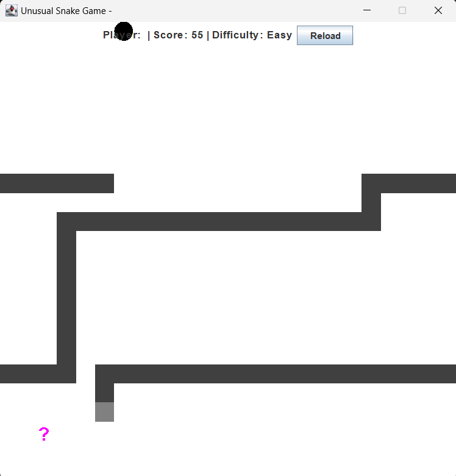

# Unusual Snake Game

## Introduction
This Java-based project transforms the classic Snake game into a multifaceted and engaging experience. By incorporating elements from other nostalgic games and quizzes, it aims to challenge players not only with traditional gameplay but also with questions on basic computer science (CS) concepts. This project was created as a learning exercise to explore and apply various design patterns in Java.

## Features
- **Classic Snake Gameplay:** Navigate the snake to eat apples and avoid crashing into itself or the game boundary.
- **Random Elements:** Special apples appear randomly that either pause the game to start a quiz on CS knowledge or switch gameplay to a Brick Breaker style game.
- **Brick Breaker Game:** A mini-game that can be triggered during the Snake game, featuring a paddle, ball, and bricks to be broken.
- **CS Quizzes:** Randomly appearing quiz apples that test the player's CS knowledge through multiple-choice questions.
- **Scoring System:** Points are earned by eating apples in the Snake game, breaking bricks in Brick Breaker, and correctly answering quiz questions.
- **Customization:** Players can choose from different color palettes and game speeds, and toggle borders and 3D behavior.
- **Admin Panel:** Allows the admin to manage quiz questions in the database.
- **Leaderboards:** Displays the top scores of players.

### Snake Game with Brick Breaker

### Snake Game

## Future Enhancements
In future updates, I plan to expand the range of mini-games integrated into this project. Potential additions include:
- **Pong**
- **Additional Snake Variants**
- **Tetris**
- **Space Invaders**
- **Frogger**
- **Asteroids**
- **Minesweeper**
- **Pac-Man**
- **Sokoban**
- **Simon Says**
- **Lunar Lander**
- **Arkanoid**
- **Pinball**
- **Flappy Bird**
- **Boulder Dash**
- **Bomberman**
- **Lemmings**
- **Tanks**

These games will be implemented to appear randomly, similar to the current special apple triggers, providing a varied and unpredictable gaming experience.

## Modules
The project is organized into several modules, each responsible for different aspects of the game:

### 1. `GamePanel.java`
- **Purpose:** Manages the main gameplay area, including game state, snake mechanics, and rendering of game elements.
- **Design Patterns Used:** 
  - **Observer Pattern:** Notifies the `SnakeGame` class when the game state changes (e.g., game over, score updates).
  - **Strategy Pattern:** Handles different behaviors for snake movement and collision detection.

### 2. `GameFrame.java`
- **Purpose:** Sets up the main game window and loads the `GamePanel`.
- **Design Patterns Used:** 
  - **Singleton Pattern:** Ensures only one instance of the main game frame is created.

### 3. `BrickBreakerGame.java`
- **Purpose:** Controls the Brick Breaker game mechanics, such as the movement of the paddle and ball, and manages the game's UI.
- **Design Patterns Used:** 
  - **Command Pattern:** Handles player input for controlling the paddle.
  - **Factory Pattern:** Creates different types of bricks.(Still unimplemented).

### 4. `QuizGame.java`
- **Purpose:** Handles the quiz mechanics, including question generation, answer validation, and scoring.
- **Design Patterns Used:** 
  - **MVC Pattern:** Separates the quiz logic, UI, and data management.
  - **Template Method Pattern:** Defines the skeleton of the quiz process.

### 5. `AdminPanel.java`
- **Purpose:** Allows the admin to manage quiz questions in the database.
- **Design Patterns Used:** 
  - **DAO Pattern:** Manages database operations for quiz questions.

### 6. `SnakeGame.java`
- **Purpose:** Integrates different game modules and manages game settings.
- **Design Patterns Used:** 
  - **Facade Pattern:** Simplifies interactions between different game components.

### 7. `TicTacToe.java`
- **Purpose:** Manages the Tic Tac Toe mini-game mechanics.
- **Design Patterns Used:** 
  - **State Pattern:** Manages the different states of the Tic Tac Toe game (e.g., player turn, computer turn).

### 8. `run_game.bat`
- **Purpose:** Batch script to compile and run the game.

### Project Directory

## Installation
To run this project:
1. Ensure you have Java installed on your machine.
2. Download the source code from this repository.
3. Compile the code using your preferred Java compiler or IDE.
4. Execute `run_game.bat` to start the game.

## Usage
- **Snake Game:**
  - Use the arrow keys or `W`, `A`, `S`, `D` keys to control the snake.
  - Avoid crashing into the walls or the snake's body.
  - Eat apples to grow and score points.
- **Brick Breaker Mini-Game:**
  - Use the left and right arrow keys or `A` and `D` keys to move the paddle horizontally.
  - Use the up and down arrow keys or `W` and `S` keys to move the paddle vertically.
  - Break all the bricks to score points.
- **Quiz Game:**
  - Select your answer using the mouse and click "Submit Answer" to confirm.
- **Tic Tac Toe Mini-Game:**
  - The player always goes first as 'X'.
  - Click on an empty cell to place your 'X'.
  - The game alternates turns between the player and the computer.
  - Note: The player cannot win; the computer is programmed to play optimally.

## Known Issues
The game is still in development and has several bugs that need to be addressed. Contributions to fix these issues are welcome.

## Contributing
Contributions to this project are welcome! Please fork this repository and submit pull requests with your proposed changes. For major changes, please open an issue first to discuss what you would like to change.

## License
This project is open-source and available under the [MIT License](LICENSE.md).

## Acknowledgments
Thanks to everyone who has contributed to testing, improving, and providing feedback for this project!

This project was developed as part of a learning exercise to understand and implement various design patterns in Java. The primary focus was on applying design patterns to create a modular, maintainable, and extensible codebase.
